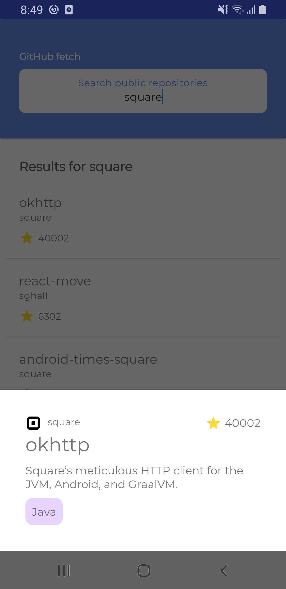

# GithubFetch

An android app fed by https://api.github.com/search/repositories, built with Kotlin using MVVM archtecture.

| Home screen         |  Showing repository details   |
| ------------------- | ----------------------------- |
|   |            |

Dependencies used
--------

- Retrofit -> HTTP requests handling
- MVVM implementation
- Picasso -> Image downloading and caching
- Navigation components
- Paging3.0 -> pagination
- Room database
- Koin -> dependency injection
